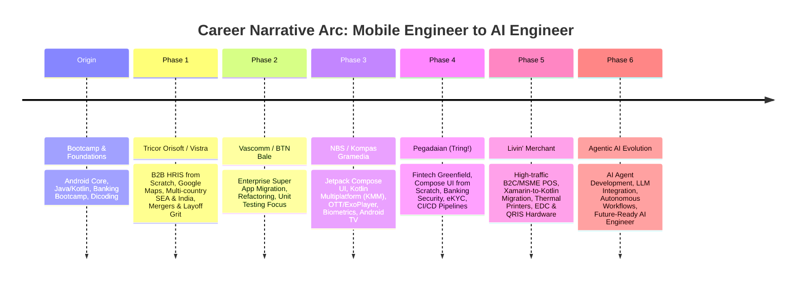

# Project Charter & Pre-Plan: 3D Software Engineer Journey Portfolio

## 1. Executive Summary & Vision
The **3D Software Engineer Journey Portfolio** (`journey-web`) is a high-performance, web-based interactive portfolio designed to chronicle a real, authentic career transformation: from an aspiring Android bootcamp student to a mid-senior mobile software engineer handling regional B2B platforms, enterprise super app migrations, modern Jetpack Compose & Kotlin Multiplatform (KMM) architectures, banking-grade security, and POS hardware integrations, culminating in an evolution toward **Agentic AI & AI Engineering**.

The project blends **immersive 3D graphics (WebGL/WebGPU)** with **exemplary user experience (UX)** and **content clarity**, ensuring that global tech recruiters, hiring managers, and technical interviewers are both visually captivated and easily able to extract concrete engineering competencies.

---

## 2. Core Strategic Goals

| Goal | Description & Target Criteria |
| :--- | :--- |
| **1. Public Deployability** | Ready for automated production deployment (e.g., Vercel/Netlify/Cloudflare Pages) with CI/CD, custom domain support, and zero manual deployment overhead. |
| **2. 100% Web-Native** | Zero installation required; seamless cross-browser rendering (Chrome, Safari, Firefox, Edge) with hardware acceleration. |
| **3. High Conversion for Job Applications** | Tailored to impress both **domestic top-tier tech firms** and **international/remote hiring teams** (Silicon Valley, Europe, Singapore, Australia). |
| **4. Effortless Comprehension** | Storyline structured with progressive disclosure. Recruiters can grasp key achievements within 30 seconds or deep-dive into architectural case studies. |
| **5. Authentic Storytelling** | Genuine reflections of actual career phases—real technical trade-offs, architectural decisions, team dynamics, critical bug fixes, and continuous growth. |

---

## 3. Target Audience Personas

1. **The Fast Recruiter (30-second scan):**
   * *Needs:* Immediate access to core skills, years of experience, notable companies/projects, contact links, and downloadable PDF resume.
   * *Solution:* Prominent **"Quick CV Mode"** toggle in the header, clear metric chips (*"Multi-country SEA rollout"*, *"CI/CD automation"*, *"Compose + KMM"*).
2. **The Engineering Manager / Tech Lead (Deep Technical Review):**
   * *Needs:* Evidence of clean code, architecture patterns (MVI/MVVM/Clean Architecture), security practices, unit test coverage, and problem-solving grit.
   * *Solution:* Expandable **Case Study Modals** with system architecture diagrams, challenge-solution-metric breakdowns, and GitHub/live demo links.
3. **The Executive / CTO / Creative Technologist (Visual & Innovation Review):**
   * *Needs:* Proof of creative problem solving, innovation capacity, modern web technology mastery, and future-readiness (AI integration).
   * *Solution:* Fluid 3D scrollytelling, interactive procedural props (smartphones, hardware receipts, biometric scan), and an interactive **AI Portfolio Agent**.

---

## 4. Authentic Journey Milestones (The Narrative Arc)

---

## 5. User Experience (UX) & Responsive Design Principles

1. **Dual-Mode Experience (Accessibility & Recruiter-Friendly):**
   * **3D Story Mode:** An interactive 3D spatial journey featuring a dynamic 3D smartphone and phase-specific holographic props.
   * **Quick Recruiter Mode:** A clean, accessible, distraction-free 2D resume view optimized for rapid evaluation and printing.
2. **Smooth & Controlled Navigation:**
   * Utilizes **Lenis** smooth scrolling synchronized with **GSAP ScrollTrigger**, preventing erratic scroll jumps.
   * Floating quick-jump phase indicators (dots/timeline navigation) allow users to jump directly to any career phase.
3. **Mobile-First Responsiveness & Graceful Degradation:**
   * Automatically scales canvas resolution based on device DPI (`Math.min(window.devicePixelRatio, 2)`).
   * On low-spec mobile devices or constrained GPUs, high-poly 3D models gracefully downgrade to lightweight animated canvas shaders or static SVG visual cards, ensuring consistent 60 FPS performance.
4. **Content-First Hierarchy:**
   * Typography strictly follows an 8pt grid with **Plus Jakarta Sans** for interface text and **JetBrains Mono** for technical specs and metrics.
   * High contrast (WCAG AAA compliant text overlays on dark glassmorphic backdrops).

---

## 6. Phase Execution Roadmap Overview

* **Phase 1: Foundation & Local Build Guarantee**
  * Project scaffold with React 18, TypeScript, Vite, Tailwind CSS, Three.js/R3F, and GSAP.
  * Local build verification (`npm run build` & `npm run dev`) confirming zero dependency warnings or errors.
* **Phase 2: Data Model & Design Tokens**
  * Construction of `journeyData.ts` encapsulating the 6 career phases with metrics and case study details.
  * Design tokens setup (cyber dark theme, glassmorphism, responsive utilities).
* **Phase 3: 2D Presentation & Recruiter View**
  * Implementation of Navbar, Hero, Timeline Scrollytelling track, Case Study modals, and Quick CV mode.
* **Phase 4: 3D Scene & Scrollytelling Controller**
  * Interactive 3D smartphone model responding dynamically to scroll coordinates.
* **Phase 5: Phase-Specific 3D Props & Micro-Interactions**
  * Custom interactive models (Maps pin, modular block, media player, gold bar, EDC receipt printer, neural sphere).
* **Phase 6: AI Portfolio Agent Widget**
  * Embedded conversational agent capable of answering recruiter questions about your engineering background.
* **Phase 7: Performance Optimization & Public Deployment**
  * Asset compression (Draco/WebP), SEO meta configuration, and production hosting setup.
